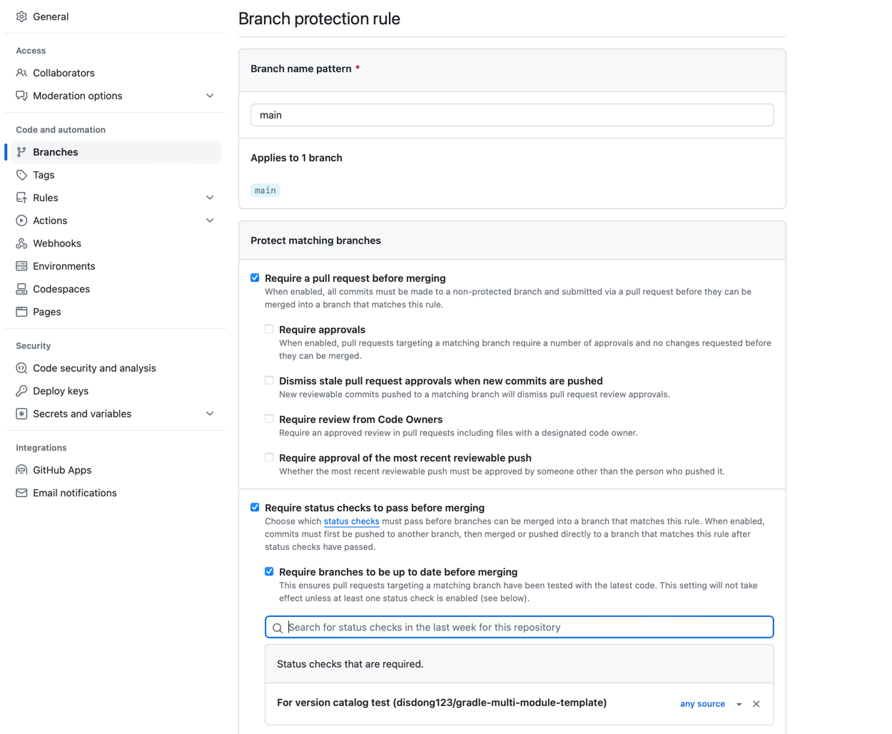

# gradle version catalog

https://docs.github.com/en/packages/working-with-a-github-packages-registry/working-with-the-gradle-registry

### 준비
Github Personal access token 을 발급받고, github username 과 함께 환경변수(.zshrc 등)로 저장해야합니다.

### 사용법

settings.gradle 파일에 아래와 같이 작성합니다.

```kotlin
enableFeaturePreview("VERSION_CATALOGS")

dependencyResolutionManagement {
    repositories {
        maven {
            url = uri("https://maven.pkg.github.com/disdong123/version-catalog")
            credentials {
                // PAT, github username 을 환경변수 (.zshrc 등)로 저장해야합니다.  
                username = System.getenv("DISDONG_USERNAME")
                password = System.getenv("DISDONG_TOKEN")
            }
        }
    }
    versionCatalogs {
        create("libs") {
            from("kr.disdong:spring-version-catalog:0.0.2")
        }
    }
}
```


## 배포
Pull request 를 이용해야합니다.

1. PR 이 생성되면 version-catalog-test workflow 를 통해 최신 버전을 테스트합니다.
   - version-catalog 를 사용하는 특정 repository 에서 최신 version-catalog 를 로컬에 publish 하고 build 해보는 방식으로 테스트합니다.
   - 테스트에 실패하면 PR 을 머지할 수 없습니다.  
2. 테스트가 완료되면 publish workflow 를 통해 version-catalog 를 수동 배포합니다.

### 테스트 repository 추가 방법
1. version-catalog-test workflow 에서 테스트하고자 하는 repository 를 추가합니다.
    ```
    workflows: [
      { repo: "disdong123/gradle-multi-module-template", workflow_id: "version-catalog-test.yaml" },
    ]
    ```
2. 테스트하고자 하는 repository 에 version-catalog-test workflow 를 추가합니다. (ex. https://github.com/disdong123/gradle-multi-module-template/blob/main/.github/workflows/version-catalog-test.yaml)
3. version-catalog repository 의 settings > Branches 의 아래 섹션에서 해당 repository 의 workflow 를 추가합니다.
    